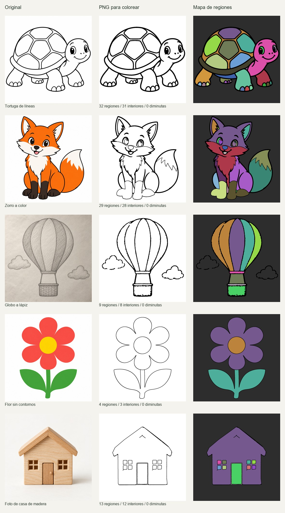

# Generador PNG: implementación, pruebas y revisión de cinco originales

07/10/2026 · PaintMe · revisión local del evaluador.

Se implementó un generador local con interfaz para cargar imágenes, convertirlas en dibujos de líneas, probar el relleno y descargar PNG, miniatura, maestro procesado e informe. El generador conserva los originales y no incorpora automáticamente resultados al catálogo.

Código: [conversor y servidor](../scripts/coloring_generator.py), [interfaz](../tools/coloring-generator/index.html), [instrucciones de uso](../tools/coloring-generator/README.md). La interfaz local se inicia con `python scripts/coloring_generator.py --serve` y abre en `http://127.0.0.1:8787/`.

## Muestras y resultado visual

Las cinco imágenes se crearon con la herramienta integrada **ImageGen**, una llamada independiente por original. La [ficha de prompts completos](../tools/coloring-generator/samples/prompts.json) conserva instrucciones y referencias de generación. Los originales están en [samples/inputs](../tools/coloring-generator/samples/inputs), y sus conversiones en [samples/outputs](../tools/coloring-generator/samples/outputs).

| Muestra | Modo | Regiones / interiores ≥16 px | Diminutas <16 px | Conversión medida | Revisión visual |
|---|---|---:|---:|---:|---|
| Tortuga | Líneas | 32 / 31 | 0 | 442 ms | Mejor preservación de la figura; los detalles de dedos y ojos aumentan la dificultad. |
| Zorro | Color | 29 / 28 | 0 | 1007 ms | Contornos funcionales y patas antes oscuras abiertas para pintar; revisar pequeños detalles de ojos y dedos antes de publicar. |
| Globo a lápiz | Líneas, contraste 230, limpieza 64, cierre 3 | 9 / 8 | 0 | 395 ms | **Requiere corrección:** las dos nubes quedan conectadas al exterior. |
| Flor sin contornos | Color | 4 / 3 | 0 | 761 ms | Buena base sencilla; los pétalos constituyen una región y tallo/hojas otra, porque no había divisiones en el original. |
| Casa fotográfica | Foto | 13 / 12 | 0 | 396 ms | Figura reconocible; limpiar el trazo residual del techo y revisar el grosor de puerta y ventanas. |

Las regiones incluyen el exterior. Una región grande cerrada no equivale a una zona fácil de tocar en un móvil. Los tiempos corresponden a una ejecución en este equipo Windows; no son un benchmark de un teléfono ni garantías para otras imágenes.

La reparación alteró conectividad en zorro, globo, flor y casa; el informe lo advierte. La foto siempre requiere revisión adicional. El modo automático no identifica fotografías con fiabilidad. Todas las conversiones conservan `review_required: true`.

La sonda de las nubes del globo confirma el problema: `(165,640)` y `(1000,785)` pertenecen a la misma región exterior de **951 992 píxeles**. Como control, `(320,410)` cae en un panel cerrado de **115 320 píxeles**. [Datos de las sondas](qa-evidence/2026-10-07/coloring-generator/sample-summary.json) y [exterior coloreado](qa-evidence/2026-10-07/coloring-generator/balloon-exterior-probe.png).

El mismo archivo de datos registra dimensiones, bytes y hashes de las cuatro variantes por muestra. Además, **30 PNG descargados** se abrieron y verificaron de forma independiente con Pillow: diez dibujos sin pintar y veinte salidas de los editores.

## Pruebas ejecutadas

Las pruebas Python comprueban transparencia, PNG/JPEG/WEBP, ruido, huecos, interiores, semillas seguras en regiones cóncavas, repetibilidad sobre los cinco originales, archivos inválidos, límites y conservación del original. Las de navegador verifican la interfaz, descarga exacta sin los colores de prueba, invalidación de resultados antiguos, carga de archivos, pantalla estrecha, informes y validación de solicitudes.

Para las cinco imágenes se compara **cada una de las 87 regiones detectadas** con el motor real de relleno: misma cantidad de píxeles, sin tocar líneas. También se abre cada PNG en los editores reales de balde y pincel, con catálogo temporal inyectado únicamente durante el test. Se verifica relleno/trazo, contornos, deshacer, guardado, recarga, recuperación y archivo PNG descargado. La prueba de las 87 regiones demuestra coherencia entre detector y motor; las sondas del globo demuestran por qué eso no basta para aprobar el diseño.

En la comprobación WebKit se detectó que una semilla cercana a una línea podía redondearse sobre ella al tocar una región cóncava. Se corrigió el detector para elegir un punto con mayor distancia al contorno, y se añadió una prueba de regresión.

Resultado final: **38/38 pruebas aprobadas**, 12 Python y 13 en cada navegador. Versiones usadas: Python 3.12.14, Pillow 12.3.0, NumPy 2.3.5, OpenCV 5.0.0, Chrome 154.0.8037.98 y WebKit 26.5. Logs: [Python](qa-evidence/2026-10-07/coloring-generator/unit-tests.txt), [Chrome](qa-evidence/2026-10-07/coloring-generator/chromium-tests.txt), [WebKit](qa-evidence/2026-10-07/coloring-generator/webkit-tests.txt). Las capturas y PNG recibidos están en la misma carpeta. WebKit automatizado en Windows y una pantalla de 390 px **no acreditan pruebas físicas en Safari iOS o Android**. Flutter queda fuera de esta prueba del prototipo local.

## Aplicación del checklist

Referencia: [checklist original](CHECKLIST-IMAGENES-COLOREAR.md). **A** = aprobado dentro del alcance local indicado; **P** = pendiente o prueba parcial; **F** = defecto confirmado; **—** = no aplica a este prototipo. No se declara ninguna muestra aprobada para todo el producto o lista para publicar.

| Control | Tortuga | Zorro | Globo | Flor | Casa | Evidencia / alcance |
|---|:---:|:---:|:---:|:---:|:---:|---|
| T-01 PNG legible | A | A | A | A | A | Decodificación Python y editores reales. |
| T-02 Rutas | A | A | A | A | A | Muestras, CLI y servidor local; no assets Flutter. |
| T-03 Resolución | A | A | A | A | A | Web 1200×1200; miniatura 360×360; original 1254×1254 conservado. |
| T-04 Proporción / encuadre | A | A | A | A | A | Variantes del resultado y comparación visual. |
| T-05 Metadatos de catálogo | P | P | P | P | P | Slugs de muestra registrados; incorporación al catálogo pendiente. |
| T-06 Selección en producto | P | P | P | P | P | Muestras y enlaces directos probados; catálogo público sin incorporación. |
| T-07 Base sin colorear | A | A | A | A | A | RGB binario 0/255 en la base web. |
| T-08 Contornos previstos | A | A | F | A | P | Nubes abiertas; pétalos y hojas conectados intencionalmente en flor. Revisar detalles de casa. |
| T-09 Líneas tras reducción | A | A | A | A | A | Se analiza y prueba la variante final de 1200 px. |
| T-10 Interiores pintables | A | A | A | A | A | Blanco puro; sin grises ni texturas en interiores. |
| T-11 Bordes / fondo | A | A | A | A | A | Exterior blanco coloreable; sin recortes en el borde. |
| T-12 Selección con dedo | P | P | P | P | P | Falta dispositivo físico y validar detalles pequeños. |
| T-13 Cobertura prevista | A | A | F | A | P | Todas las regiones detectadas cubiertas; nubes no forman interiores independientes. |
| T-14 Sin fugas semánticas | A | A | F | A | P | Sondas del globo; casa necesita definir separaciones finales. |
| T-15 Protección completa | P | P | P | P | P | Trazo y balde conservan líneas; falta completar todas las interacciones del control. |
| T-16 Cambio de color | P | P | P | P | P | No se ejecutó la secuencia completa por región. |
| T-17 Pincel / borrador | P | P | P | P | P | Trazo largo probado; falta matriz de grosores y borrador. |
| T-18 Deshacer | A | A | A | A | A | Balde y pincel vuelven al original exacto. |
| T-19 Equivalencia de motores | P | P | P | P | P | Worker y motor compartido probados; falta secuencia completa del fallback del editor. |
| T-20 Recuperación multicolor | P | P | P | P | P | Recuperación exacta de una operación probada; falta secuencia multicolor. |
| T-21 Obras independientes | P | P | P | P | P | Cada slug/modo en contexto aislado; falta alternar A/B en el mismo contexto. |
| T-22 PNG exportado | A | A | A | A | A | Archivo recibido idéntico al PNG del canvas, en ambos editores y navegadores. |
| T-23 Tres salidas progresivas | P | P | P | P | P | Una salida por estado/modo/navegador en esta prueba. |
| T-24 Impresión | — | — | — | — | — | El prototipo ofrece PNG; no se validó una salida de impresión. |
| T-25 Destinos físicos | P | P | P | P | P | Automatización de escritorio; falta Android/iOS físicos. |
| T-26 Zoom / rotación | P | P | P | P | P | Diseño de 390 px sin desbordamiento; falta gestos y rotación. |
| T-27 Equipo modesto | P | P | P | P | P | Tiempos locales registrados; falta dispositivo objetivo. |
| T-28 Peso / memoria | P | P | P | P | P | Dimensiones y archivos disponibles; falta medición de memoria y carga física. |
| E-01 Figura reconocible | A | A | A | A | A | Original, resultado y miniatura inspeccionados. |
| E-02 Dificultad | P | P | P | P | P | Flor candidata sencilla; falta validación de uso con público previsto. |
| E-03 Categoría / pack | — | — | — | — | — | Muestras de laboratorio, sin pack público. |
| E-04 Presentación limpia | A | P | F | A | F | Globo irregular; detalles de zorro por revisar; trazo residual en casa. |
| P-01 Procedencia | A | A | A | A | A | Prompts, referencias, originales y hashes archivados. |
| P-02 Uso previsto | P | P | P | P | P | Decisión de publicación y uso comercial fuera del prototipo. |
| P-03 Personajes / marcas | A | A | A | A | A | Motivos genéricos sin marcas visibles, revisados visualmente. |
| P-04 Publicación coherente | A | A | A | A | A | Todas permanecen fuera de assets, fichas y packs públicos. |

## Recomendación a partir de la prueba

Crear los originales directamente como dibujos de contornos cerrados sobre blanco ofrece una base más fiable. Para convertir ilustraciones, preferir colores planos y formas amplias. Para lápiz o fotografías, usar el generador como preparación y después corregir contornos y separaciones. El conteo de regiones sirve para encontrar cambios, pero la aprobación depende de que las regiones coincidan con lo que se pretende colorear.
