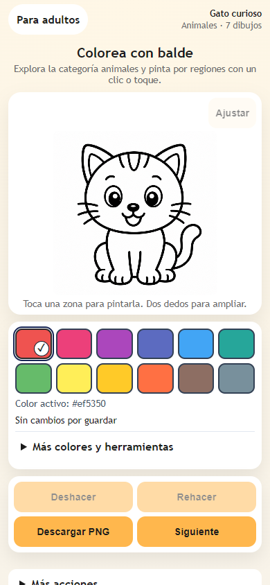
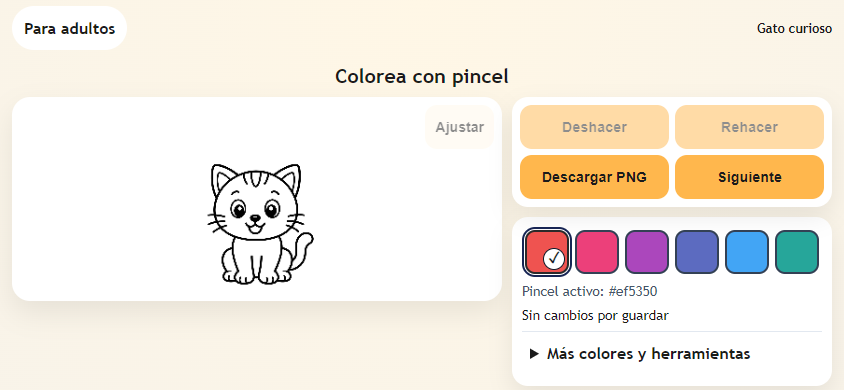

# PaintMe — Ítems 11 a 20, excepto CAT-02

Fecha: 07/10/2026. Cambios locales, sin commit, push, despliegue, cobros ni activación de anuncios. Alcance autorizado: WEB-11, UX-01/02/03/04/05 y CAT-01/03/04. **CAT-02 excluida expresamente**; su tarea y dependencias comerciales permanecen sin atender.

## Resultado por tarea

| Ítem | Tarea | Estado | Resultado y límite |
|---:|---|---|---|
| 11 | WEB-11 | Hecho | Rehacer en ambos motores; nueva edición invalida la rama futura; reset, restauración, carga y autosave coordinados. Historial limitado por pasos y bytes. |
| 12 | UX-01 | Parcial | Lienzo primero, 12 colores, Deshacer/Rehacer/Descargar/Siguiente visibles; opciones avanzadas plegadas y sin reservas publicitarias. Diez combinaciones de modo/tamaño pasan por navegador. Faltan dispositivos y prueba acompañada ≥8/10 en ≤30 s. |
| 13 | UX-02 | Parcial | Selección visual, miniaturas grandes, niveles gráficos, filtros y búsqueda plegada; colección de copias locales con miniatura de la obra. Carga/vacío/error y copia corrupta tratados. Falta observar facilidad con personas. |
| 14 | UX-03 | Parcial | Maqueta sin botones ficticios, categorías enlazadas, CTA directo al balde, pincel secundario y promesas precisadas. Destino de contacto preparado; falta el correo/URL confirmado del operador. |
| 15 | UX-04 | Parcial | Nombres de colores, aria-pressed, marca de selección, foco visible, objetivos de 44 px y retorno de foco de reset. Contraste de cuatro textos/controles esenciales ≥4,5:1 verificado. Falta lector real, escalado y contraste integral; canvas no declarado completamente accesible. |
| 16 | UX-05 | Parcial | Zona adulta plegada para preferencias, impresión y enlaces; página de ayuda familiar/docente. Se puede pintar sin aceptar. La política/tratamientos de PRIV-01/02 siguen pendientes. |
| 17 | CAT-01 | Parcial | Fuente única, casas/paisajes propios, cohete bien etiquetado conservando slug, tema/nivel gráfico y distribución explícita. Queries/filtros web verificados. Código Flutter alineado y sintaxis leída; faltan analyzer/tests/recorrido móvil con SDK compatible. |
| 18 | CAT-02 | Excluida | Sin implementación de procedencia, licencias o filtro comercial. No se acreditaron derechos. |
| 19 | CAT-03 | Hecho técnico | Generador reproducible de variantes/catálogos y sincronización de páginas existentes. 227 salidas, repetición sin diferencias y ocho pruebas. Derechos/publicación siguen siendo dependencias externas. |
| 20 | CAT-04 | Parcial | 62 dibujos con control técnico e inventario; 248 recorridos automatizados de pintar/exportar. Falta revisión manual de regiones/contornos y matriz física; no equivale a aprobación gráfica o comercial. |

## Cambios de funcionamiento

El historial comparte un límite entre Deshacer y Rehacer: diez pasos y 32 MiB en balde; veinte pasos y 48 MiB en pincel. A 1200×1200 quedan como máximo cinco u ocho snapshots RGBA, respectivamente. El resto de memoria del canvas, capas y PNG no está incluido: WEB-10 continúa pendiente de perfil físico. Recargar/cambiar de dibujo no conserva el historial; guardar conserva la obra actual, no sus ramas.

El editor muestra el dibujo antes de los controles. Las opciones de paleta, color personalizado, grosor y borrador están en «Más opciones»; reiniciar y sorpresa, en «Más acciones». En paisaje estrecho el dibujo queda a la izquierda y las acciones a la derecha. Los estilos compartidos viven en `web/editor-layout.css`. Ningún slot vacío reserva espacio en el editor y se eliminó allí la carga del script AdSense.

«Elegir otro dibujo» contiene copias locales por modo, con el PNG guardado como miniatura, y el catálogo visual. Las copias se leen con una transacción, se combinan con backups recientes y se limitan a doce. Una copia ilegible aparece deshabilitada con aviso; no promete restaurarla ni bloquea el resto de la actividad. Las comprobaciones cubren continuar una obra de otro tema, borrar y datos corruptos.

La zona adulta permite imprimir una captura de la obra; los tests sustituyen `window.print` y comprueban la imagen preparada y la conservación del lienzo. **No verifican papel, márgenes o diálogo real del sistema.** La página adulta explica guardado/PNG y las limitaciones de modo/dispositivo. `site-config.json` contiene contacto vacío; el cargador admite solo correo o URL HTTP(S) seguros y muestra honestamente que no hay canal publicado.

La separación adulta es una organización de interfaz. No es verificación parental ni consentimiento legal. GA y la lógica previa de flags siguen pendientes de PRIV-01; no se afirma que rechazar suprima todas las solicitudes de terceros. Los enlaces identifican la política actual como política de aplicación; PRIV-02 deberá completar web/app y operador.

## Taxonomía y pipeline

Las casas dejan Navidad; los paisajes dejan Animales. La imagen histórica `house4.png` representa un cohete: etiqueta «Cohete sencillo», categoría Vehículos y slug `casa-4` conservado. La clasificación gráfica es orientativa; 19 entradas quedan `por-revisar`. No se añadieron campos de licencia ni aprobaciones.

El manifiesto maestro ahora enumera los 62 PNG ya existentes, manteniendo 43 entradas móviles y 19 exclusivas web. El generador mantiene URLs de assets y slugs; preserva los maestros y prepara variantes RGB sobre blanco. Hay 171 salidas de imágenes/catálogos y 56 páginas existentes sincronizadas: queries correctas y relacionados por categoría. No se crean fichas nuevas, sitemap ni páginas Gabby adicionales. [Comandos y mantenimiento del pipeline](../CATALOG-PIPELINE.md).

## Verificación

| Comprobación | Resultado |
|---|---|
| Node: sintaxis, motor, storage, historia, catálogos y enlaces estáticos | 38/38 |
| Python: reproducibilidad, validación, límites, conservación y plataformas | 8/8 |
| Suite Chrome 154.0.8037.98 / WebKit 26.5, headless Windows | 66/66 en cada motor |
| Comprobaciones finales de contraste/impresión/foco y páginas recategorizadas | 3/3 adicionales en cada motor; dos amplían casos ya presentes |
| Catálogo real | 62 dibujos × 2 modos × 2 motores = 248 recorridos pintar/exportar |
| Generador repetido | 62 maestros, 227 salidas, cero diferencias |
| Calidad técnica por PNG | 62/62; dimensiones, proporción, compatibilidad del pincel |
| Dart format `--output=none` sobre los tres archivos modificados | Parse correcto; cero cambios de formato |

Los 66 casos completos incluyen el catálogo real antes de corregir los enlaces estáticos. Después se probaron las nueve páginas afectadas, en ambos modos, y se revalidaron todos los enlaces mediante Node. La suite actual contiene 67 casos únicos; no se presenta como una ejecución completa de 67.

Los PNG descargados se decodifican y se compara SHA-256 de **todos los píxeles RGBA** con el lienzo, además de dimensiones. El balde usa el worker real; el pincel aplica una marca programática al motor. No son 248 sesiones humanas ni revisiones de cada región. Los tests de regiones/contornos aislados usan fixtures. El servidor HTTPS conserva CSP y bloquea terceros; no es una auditoría HAR.

Una aceleración antigua a 10 ms de los deadlines de los mocks IndexedDB falló bajo carga paralela de CPU; se aumentó a 200 ms exclusivamente en el test. Los deadlines de producción no cambiaron y el gate completo pasó nuevamente.

Flutter no se actualizó ni compiló: el Dart disponible es 3.7.2 y el proyecto exige ^3.11.5; falta un entorno compatible. Parsear/formatear no equivale a analyzer o tests. No se ejecutó una app física.

## Evidencia y pendientes

- [Control técnico y hashes de maestros](web-eleven-twenty/artwork-technical.json).
- [Registro manual por dibujo, aún pendiente](web-eleven-twenty/artwork-review.csv).
- [Exportaciones Chrome: balde](web-eleven-twenty/chromium-artwork-paint.json) y [pincel](web-eleven-twenty/chromium-artwork-brush.json).
- [Exportaciones WebKit: balde](web-eleven-twenty/webkit-artwork-paint.json) y [pincel](web-eleven-twenty/webkit-artwork-brush.json).
- [Inspección de taxonomía](web-eleven-twenty/taxonomy-contact-sheet.png).
- [Pruebas pendientes consolidadas](../PRUEBAS-PENDIENTES.md): dispositivos, gestos, rendimiento, lectores, impresión, personas, contacto, privacidad y Flutter.

Para repetir: `node scripts/check-web.cjs`, `python -m unittest discover -s tests -p test_catalog_pipeline.py -v`, `python scripts/build_catalog.py` y `python scripts/check-artwork.py`. La suite de navegador usa los comandos/variables del [informe 6–10](web-six-ten.md); las dependencias son de desarrollo. CAT-02 permanece excluida incluso al ejecutar el pipeline.
