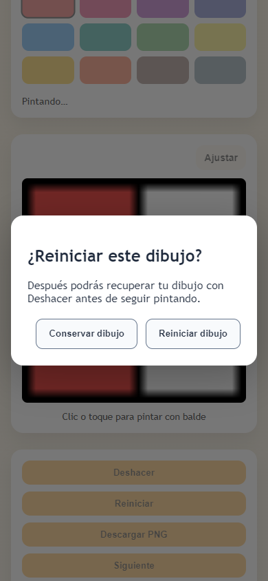
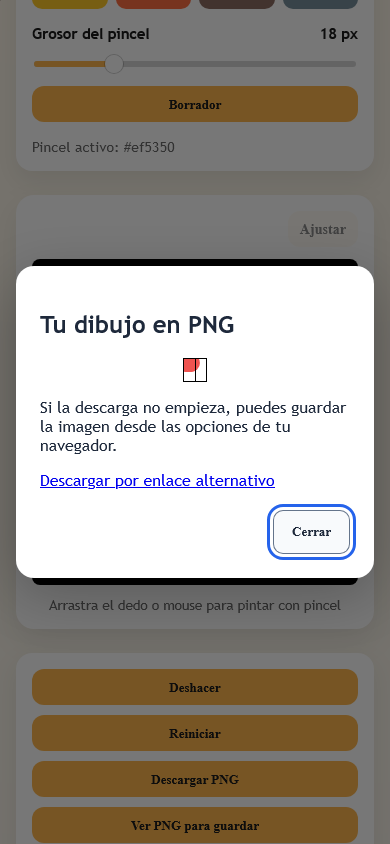

# PaintMe — Implementación de las tareas 6 a 10

Fecha: 07/10/2026. Trabajo local sobre [el backlog técnico](../PRODUCT-BACKLOG.md). Sin commit, push, despliegue ni activación de integraciones comerciales.

## Resultado por tarea

| Orden | Tarea | Estado | Resultado |
|---:|---|---|---|
| 6 | WEB-05: estado de guardado y recuperación | Hecho | Estado persistente separado de herramientas y exportación: pendiente, guardando, guardado, copia disponible, recuperado y error. Reintento explícito. El éxito se anuncia después de persistir la revisión actual. |
| 7 | WEB-06: exportación PNG | Parcial | Descarga y alternativa implementadas y verificadas en Chrome y WebKit automatizados. Falta comprobar Chrome Android y Safari iOS en dispositivos físicos. |
| 8 | WEB-09: carreras entre operaciones | Hecho | Acciones incompatibles bloqueadas durante relleno, restauración, exportación y cambio de dibujo; resultados asíncronos ligados a dibujo, revisión e identidad de carga. Errores y esperas agotadas permiten volver a usar el editor. |
| 9 | WEB-08: reinicio seguro | Hecho | Confirmación con cancelar; el estado anterior queda en Deshacer. Reinicio y autosave se coordinan para que una escritura anterior no reaparezca. |
| 10 | QA-02: continuidad y exportación | Parcial | Suite reproducible en ambos motores, matriz de tamaños y fallos simulados. Pendientes la matriz física y la integración de privacidad definitiva de PRIV-01. |

## Cambios de comportamiento

Los dos editores muestran el estado del guardado local en su propio mensaje. Cambiar de color no borra un fallo de persistencia. Reintentar vuelve a capturar la obra actual y comprueba el resultado de escritura. Una copia guardada ilegible no sustituye el lienzo ni impide seguir pintando; su recuperación deja un error visible.

«Descargar PNG» prepara una captura independiente del lienzo. Se manejan excepción, resultado nulo, MIME incorrecto y espera agotada de `toBlob`. El enlace de descarga se añade al documento y su object URL se libera después de 30 segundos. La vista previa permite guardar la imagen o descargar por un enlace alternativo. La interfaz dice «PNG preparado para descargar»; el evento `save_png` incluye `export_result: download_requested`, sin afirmar que el usuario recibió o abrió el archivo. Una exportación obsoleta no inicia una descarga.

Mientras se recupera, exporta, rellena o cambia una imagen, las acciones que podrían modificar su resultado quedan deshabilitadas y sus handlers también comprueban el estado. Las respuestas tardías de worker, decodificación y exportación se descartan. Un worker fallido se termina y usa el motor compartido de fallback sobre una nueva captura válida. Las cargas anteriores se abortan; fetch y decodificación tienen un límite total de 10 segundos. Los bitmaps que lleguen después del aborto se cierran. Decodificar una copia guardada tiene un límite de 8 segundos.

Reiniciar abre un diálogo que enfoca «Conservar dibujo». Cancelar mantiene obra y guardado. Confirmar espera la cola de escrituras, conserva un snapshot para Deshacer y borra la copia persistente con resultado explícito. «Recuperar reinicio» permite devolver la obra mientras ese snapshot siga en el historial de la página. El historial sigue acotado; **no es una papelera persistente ni conserva el reinicio después de recargar o cambiar de dibujo**.

Las pruebas táctiles descubrieron que un toque del pincel sin arrastre no dejaba un punto. Ahora se pinta un círculo con el grosor elegido, también aplicable al borrador, conservando la protección de contornos.

Se añadió un botón para reabrir las preferencias existentes de privacidad. Rechazar nuevamente actualiza los cuatro flags de consentimiento a `denied` sin modificar el dibujo. Esto permite probar el recorrido; **no cierra PRIV-01 ni demuestra ausencia de peticiones, datos o cookies de terceros en producción**.

Archivos principales: [helpers](../../web/app-utils.js), [balde](../../web/paint.js), [pincel](../../web/brush.js), [worker](../../web/paint-worker.js), HTML y CSS de ambos editores.

## Verificación automatizada

| Comprobación | Entorno | Resultado |
|---|---|---|
| Sintaxis, recursos, motor, almacenamiento y helpers | Node, suite de lógica | 34/34 |
| Recorridos de editor y descargas | Chrome 154.0.8037.98, headless Windows | 47/47 |
| Mismos recorridos y descargas | WebKit 26.5, Playwright build 2336, headless Windows | 47/47 |
| Detección de los defectos originales W1 y W2 | Copias temporales alteradas | Cada defecto devuelve exit code 1 |
| Revisión de cambios versionados | `git diff --check` | Sin errores de whitespace |

Las suites cubren ambos editores, veinte recorridos pintar→deshacer→guardar→recargar→restaurar por motor, cierre/reapertura, fallos de almacenamiento y recuperación, reinicio cancelado/confirmado/deshecho, copias corruptas, callbacks obsoletos, error de worker, descarga repetida y alternativa ante `toBlob` nulo. Se simulan también un fetch con HTTP 503 y una decodificación detenida; al agotarse el límite se liberan los controles y una carga nueva funciona. Los límites de espera se aceleran en las pruebas de fallo.

Los PNG descargados se leen desde el archivo entregado por Playwright: firma PNG, nombre, dimensiones y **todos los píxeles RGBA** comparados con la captura esperada tras decodificar el archivo en el navegador. El fixture de 24×24 tiene borde negro y dos regiones separadas; identifica pérdidas de colores, contornos o capas. Otra prueba carga el catálogo y recursos reales de ambos editores sin errores JavaScript. El fixture no certifica la calidad gráfica de todos los dibujos del catálogo.

La matriz automatizada utiliza anchos de **360, 390, 768 y 1280 px**. Los dos primeros incluyen emulación táctil y un toque mediante `touchscreen.tap`, con exportación y restauración. Son viewports y eventos simulados: no prueban memoria, gestos, descargas o almacenamiento de un teléfono real. WebKit para Windows tampoco equivale a Safari iOS.

Todas las solicitudes ajenas al servidor local se bloquean durante las pruebas, incluso al pulsar Aceptar. La comprobación de rechazo/revocación observa flags y continuidad del dibujo; no es una auditoría HAR de producción ni una validación legal o publicitaria.

El servidor de pruebas usa HTTPS con un certificado efímero generado mediante OpenSSL, para conservar la CSP de producción y `upgrade-insecure-requests` en ambos motores. La excepción de certificado se limita al contexto de Playwright. No se instala confianza en el sistema ni se versionan claves; los archivos temporales se eliminan al terminar.

## Cómo repetir

Desde la raíz:

```powershell
node scripts/check-web.cjs
node scripts/verify-web-gate.cjs

# Playwright disponible en el entorno de desarrollo; no es dependencia de producción.
$env:PAINTME_PLAYWRIGHT_PATH = 'C:\Users\amilc\.cache\codex-runtimes\codex-primary-runtime\dependencies\node\node_modules\playwright'
$env:PAINTME_BROWSER_ENGINE = 'chromium'
node scripts/check-web.cjs --browser

$env:PAINTME_BROWSER_ENGINE = 'webkit'
node --test tests/web-browser.test.cjs
```

Si Playwright está instalado y accesible como `playwright`, no hace falta `PAINTME_PLAYWRIGHT_PATH`. Chrome usa por defecto `C:\Program Files\Google\Chrome\Application\chrome.exe`; `PAINTME_BROWSER_PATH` permite indicar otro ejecutable compatible. WebKit requiere su navegador instalado mediante el CLI de la misma versión de Playwright. En este entorno se instaló con `node <ruta-a-playwright>\cli.js install webkit`.

En Windows, OpenSSL usa por defecto `C:\Program Files\Git\usr\bin\openssl.exe`; se puede configurar `PAINTME_OPENSSL_PATH`. `PAINTME_EVIDENCE_DIR` permite guardar las capturas de diálogos. Las herramientas pertenecen al entorno de pruebas; la web continúa estática y sin dependencias npm.

## Evidencia visual revisada

Capturas en viewport de 390 px usando el fixture, con diálogos de reinicio y alternativa PNG. El tamaño reducido de la imagen de vista previa corresponde al fixture de 24×24.





## Matriz física pendiente

No se utilizó un teléfono Android, iPhone ni iPad físico. Estos checks siguen abiertos para WEB-06 y QA-02:

| Entorno | Recorrido requerido | Estado |
|---|---|---|
| Chrome Android físico | Balde y pincel; toque/trazo; tres descargas seguidas; abrir PNG y comprobar tamaño, contornos y colores; vista previa y enlace alternativo | Pendiente |
| Safari iPhone/iPad físico | Mismo recorrido, guardado mediante las opciones reales del navegador y apertura del archivo; retrato/paisaje | Pendiente |
| Ambos dispositivos | Guardado/recuperación tras ocultar, cerrar y reabrir; sesión privada y almacenamiento no disponible; reinicio, cancelar y recuperar | Pendiente |
| Privacidad de release | Rechazo/revocación con inventario real de red y configuración definida por PRIV-01 | Pendiente, dependencia del backlog |

La corrección queda preparada para esas verificaciones. No se declara QA móvil física aprobada ni se publica como consecuencia de los resultados automatizados.

## Seguimiento de pruebas pendientes

Para ejecutar después y registrar resultados: [checklist consolidado de QA pendiente](../PRUEBAS-PENDIENTES.md). Conserva la matriz física de este informe y añade casos detallados, dependencias y plantilla de evidencia.
